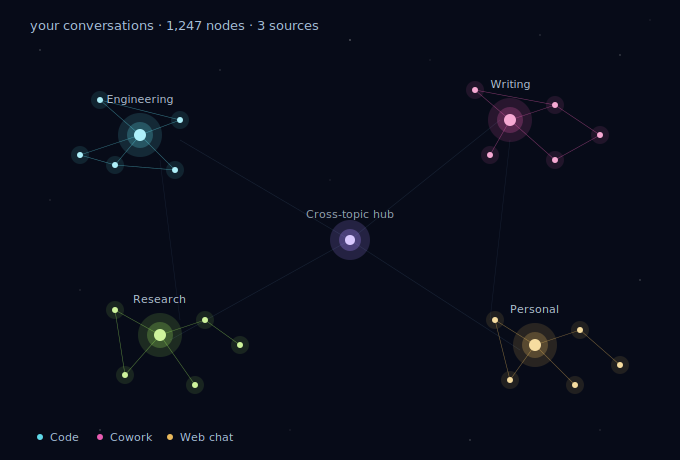

# claude-constellation

An interactive 3D map of every conversation you've ever had with Claude — across Claude Code, Cowork, and claude.ai web chat.



Each conversation is a star. Stars cluster by semantic similarity. Edges connect related conversations. A side panel reads what each one was about, surfaces the patterns you keep falling into, the long sessions you've forgotten, the cross-disciplinary bridges, and — if you opt in — uses Claude to surface things you've missed and let you ask natural-language questions over your entire archive.

Everything runs locally. The only data that ever leaves your machine is what you explicitly send to the Claude API when you click `ask` or `generate discoveries` — and it goes directly to `api.anthropic.com` with your own key.

---

## Highlights

- **3D constellation** — drag to rotate, scroll to zoom, click any star to fly the camera in and open its detail panel. Focus-on-zoom dims distant clusters as you move closer so the canvas stays readable.
- **Semantic clustering** — TF-IDF + label-propagation on a kNN graph by default. Drop in `fastembed` (or `sentence-transformers`) to upgrade to dense embeddings (bge-small-en-v1.5) for much sharper clusters.
- **LLM-named clusters** — optional. Set `ANTHROPIC_API_KEY` and the build pass asks Claude Haiku to give each cluster a 2-4 word topic name like *Three.js scene composition* instead of *Svg · Preview*.
- **Insights panel** with five tabs:
  - **discover** — ask Claude (one call per refresh, cached 24h) to surface abandoned threads, unfinished thinking, unexpected connections, and natural next questions. Each result links to the specific chats it draws from.
  - **ask** — natural-language Q&A over your archive. Browser does TF-IDF retrieval locally, ships the top-5 relevant chats + your question to Claude, streams the answer back.
  - **stuck patterns** — opener-similarity union-find groups the questions you've asked over and over.
  - **forgotten gold** — long substantive sessions (≥20 msgs) you haven't opened in 30+ days, ranked by `msgs × days_ago`.
  - **clusters** — per-cluster digests with date range, message totals, and top chats.
- **Contextual insights** — selecting a star auto-filters every insights tab to that chat's neighborhood. Clicking a cluster legend item filters to that cluster.
- **Continue in Claude desktop** — every web-source chat has a button that deep-links via the `claude://` URL scheme to that exact conversation in the desktop app. One click and you're back inside it.
- **Bridge detection** — chats whose neighbors span 3+ clusters get a halo sized by their connection count. These are usually the most cross-disciplinary conversations.
- **Repeat-question detection** — pairs of chats with very-similar opening prompts get flagged so you can see where you're going in circles.
- **Light or dark theme** — toggle in the bottom-right controls. Light mode is monochrome by design (single dark slate on cream), good for screenshots and focused reading.
- **Guided tour** — auto-runs the first time you open the page, can be re-triggered with the `?` button.
- **Auto-refresh** — Mac launchd job that re-builds the constellation any time a fresh claude.ai export lands in `~/Downloads`.
- **Single HTML file output** — the entire visualization is one self-contained file. d3.js and three.js load from CDN; all your conversation data is inlined as JSON. No backend, no server.

---

## Quick start

Requires Python 3.10+. The base build needs zero pip dependencies.

```bash
git clone https://github.com/YOUR_USERNAME/claude-constellation.git
cd claude-constellation
python3 claude_constellation.py
open conversation-constellation.html
```

By default it scans `~/.claude/projects/` (where Claude Code and Cowork both store transcripts on macOS) and renders a constellation of whatever's there.

### Add your claude.ai web chats

1. Go to [claude.ai](https://claude.ai) → click your initials → **Settings** → **Privacy** → **Export Data**.
2. Wait for the email (a few minutes to an hour).
3. Drop the zip in `~/Downloads`.
4. Re-run with the path:

```bash
python3 claude_constellation.py --web-export ~/Downloads/data-XYZ.zip
```

The zip parser auto-locates `conversations.json` inside the export.

### Mac users — one-click everything

Three command files in the repo run the pipeline without touching a terminal:

- **`setup-mac.command`** — first-time setup. Scans `~/.claude/projects/`, picks up any export zip in `~/Downloads`, writes the HTML to your Desktop.
- **`refresh.command`** — manual rebuild. Uses the most recent export zip; if it's >14 days old, opens claude.ai/settings so you can click Export and waits for the new zip to land, then rebuilds.
- **`auto-refresh.command`** — same as refresh, but uses AppleScript to click the Export button in Chrome for you (one-time Chrome setting required: View → Developer → Allow JavaScript from Apple Events).
- **`install-schedule.command` / `uninstall-schedule.command`** — installs/removes a Mac LaunchAgent that rebuilds the constellation daily at noon. Combined with the export flow above, the map stays current without you doing anything.
- **`install-deps.command`** — installs `fastembed` for dense embeddings (optional, big quality boost). ~200MB.

---

## CLI

```
python3 claude_constellation.py [options]

  --code PATH              Claude Code / Cowork session storage
                           (default: ~/.claude/projects)
  --web-export PATH        claude.ai data export — zip or unzipped folder
  --output PATH            output HTML (default: ./conversation-constellation.html)
  --template PATH          HTML template (default: ./template.html)
  --min-messages N         drop arcs with fewer than N messages (default: 1)
  --gap-hours N            split sessions into arcs at user-idle gaps of N hours
                           (default: 4)
  --max-clusters N         cap distinct clusters (default: 12)
  --knn N                  similar-neighbors per node used for clustering
                           and edges (default: 6)
  --max-bridges N          cap cross-cluster semantic bridge edges (default: 35)
  --no-embeddings          force TF-IDF even if a dense embedding backend is installed
  --no-llm-names           skip LLM cluster naming even if ANTHROPIC_API_KEY is set
  --graph-json PATH        also dump the raw graph JSON (useful for debugging)
```

### Examples

Tighter, more focused graph:
```bash
python3 claude_constellation.py --min-messages 10 --max-clusters 6 --max-bridges 15
```

Everything, with embeddings and LLM names:
```bash
pip install fastembed
export ANTHROPIC_API_KEY=sk-ant-...
python3 claude_constellation.py --web-export ~/Downloads/data-XYZ.zip
```

Custom output and template:
```bash
python3 claude_constellation.py --output ~/Desktop/mine.html --template ./my-template.html
```

---

## Optional power-ups

The base build runs on the Python standard library and produces good clusters via TF-IDF. Two optional installs unlock the next tier:

### Dense embeddings (best cluster quality)

```bash
pip install fastembed
```

If `fastembed` is importable, the script automatically swaps from TF-IDF to bge-small-en-v1.5 embeddings (~130 MB model, cached locally). Clustering and similarity edges become noticeably sharper, especially on web chats where TF-IDF struggles. As a fallback, `sentence-transformers` is also detected if installed.

Embeddings are cached to `~/.cache/claude-constellation/` so subsequent refreshes don't recompute them.

### LLM cluster names + insights features

Set an Anthropic API key in your shell:

```bash
export ANTHROPIC_API_KEY=sk-ant-...
```

This enables three features:

1. **At build time:** each cluster gets a concise human-readable name via Claude Haiku (~12 API calls per refresh, cached). Names like *Svg · Preview* become *Three.js rendering*.
2. **In-browser `ask` tab:** paste your key into the panel (stored in browser localStorage) and ask questions over your full archive. Local TF-IDF retrieval picks the top-5 relevant chats; Claude answers grounded in them.
3. **In-browser `discover` tab:** Claude reads metadata about your recent chats, repeat patterns, bridges, and forgotten sessions, and surfaces 4–6 specific observations about things you've missed.

Per question / discovery generation costs roughly **$0.01–0.02** with Haiku.

---

## How it works

**Crawler** walks `~/.claude/projects/` looking for `*.jsonl` transcripts and, if a web export is provided, parses `conversations.json`. Long-running local sessions split into per-day "arcs" so a multi-week project shows as a chain of nodes instead of one giant blob.

**Clusterer** turns each chat into a feature vector — either TF-IDF over title + opening + summary, or a 384-dim embedding via fastembed — then builds a k-nearest-neighbor graph and runs label-propagation community detection. Smaller groups merge into `Other`.

**Edges** are the top-2 most-similar intra-cluster neighbors per node plus the top-N semantic bridges between clusters (default 35).

**Insights** are computed once per refresh:
- Repeat-question groups via union-find on opener-similarity pairs.
- Bridge nodes (≥3 cluster neighbors) tagged for visual emphasis.
- Forgotten-gold ranking by `messages × days_since_last_activity`.
- Cluster digests with date range, message totals, top chats.

**Renderer** is a single self-contained HTML file. Three.js for the 3D scene, sprite-based glow halos with additive blending, golden-spiral cluster placement, custom orbit controls. The graph JSON is inlined directly into the file — no fetch, no server, no dependency on the source data once the file is generated.

---

## Privacy

Everything happens on your machine by default:

- Crawler reads only the files you point it at.
- The HTML output contains your conversation data inlined; nothing fetches it back.
- d3 and three.js load from cdnjs but they're libraries — no telemetry, no calls home.

**The two features that make external API calls are opt-in:**

- **`ask` tab** — sends your question + 5 retrieved chat snippets (titles, openings, summaries) to `api.anthropic.com` using *your* API key.
- **`discover` tab** — sends metadata for ~30 recent chats + repeat patterns + bridges to `api.anthropic.com` using *your* API key.

Your key is stored only in your browser's `localStorage`. The build-time LLM cluster naming uses the same key from the environment variable.

No analytics, no telemetry, no third-party trackers anywhere.

---

## What it can't see

- **claude.ai chats you've deleted** before running the data export.
- **Anything you've used outside the Claude apps** — direct API integrations, third-party tools building on Claude, etc.
- **Cowork session content on machines where Cowork doesn't share `~/.claude/projects/` storage.** As of May 2026 it does on macOS; if that changes you'd need an alternate ingestion path.

---

## Repo layout

```
claude-constellation/
├── claude_constellation.py   # CLI — crawl, cluster, build edges, render
├── template.html             # the standalone 3D viewer (gets __GRAPH_JSON__ inlined)
├── setup-mac.command         # Mac one-click first-run
├── refresh.command           # manual rebuild
├── auto-refresh.command      # rebuild + auto-click export in Chrome
├── refresh-quiet.sh          # silent rebuild for cron/launchd
├── install-schedule.command  # install daily LaunchAgent
├── uninstall-schedule.command
├── install-deps.command      # install fastembed for embeddings
├── examples/
│   └── preview.svg
├── LICENSE
└── README.md
```

---

## Limitations and known sharp edges

- The 3D view is **desktop-class** — usable on touch but the controls (orbit + scroll-zoom + click-pick) are mouse-first. A mobile 2D fallback is in scope but not built.
- Long-running sessions get split into arcs by **time gaps**, not topic shifts. A 50-message session about three different things will be one node.
- Per-message granularity (drilling into a session to see individual exchanges as a sub-graph) doesn't exist. Sessions are atoms today.
- `claude://` deep links require the Claude desktop app to be installed and registered as the URL handler; fallback to the browser is provided.

---

## Contributing

PRs welcome. Open issues for:

- A Windows / Linux path for finding session storage.
- Per-message drill-in.
- A time-axis layout mode (z = chronology).
- Markdown wiki export (drop into Obsidian).
- Mobile-friendly 2D fallback view.

---

## License

MIT — see [LICENSE](LICENSE).
